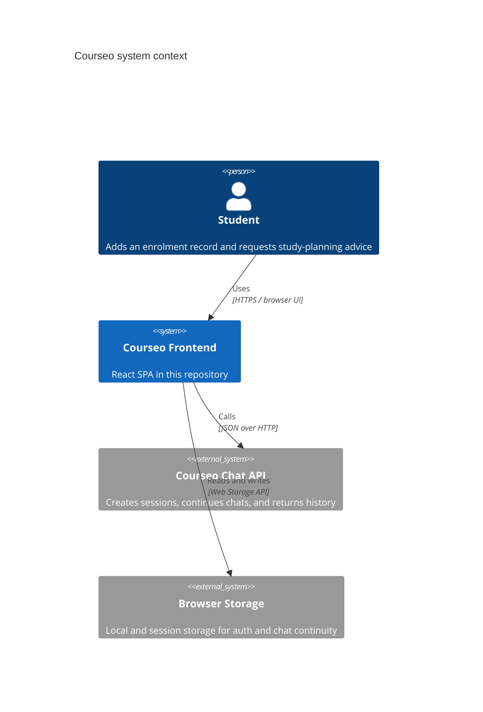
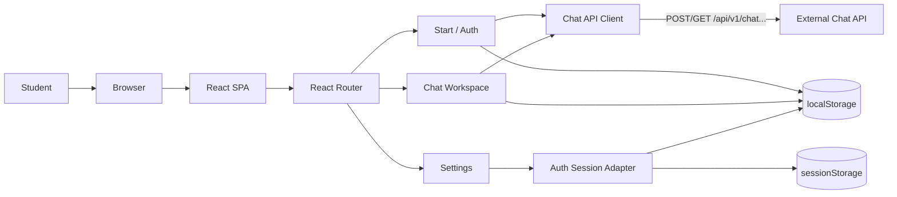
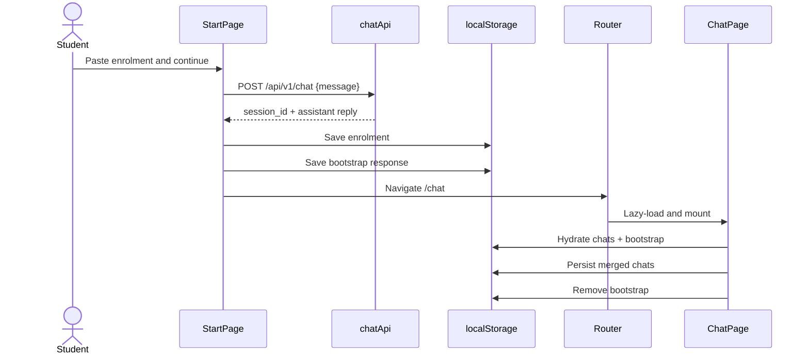
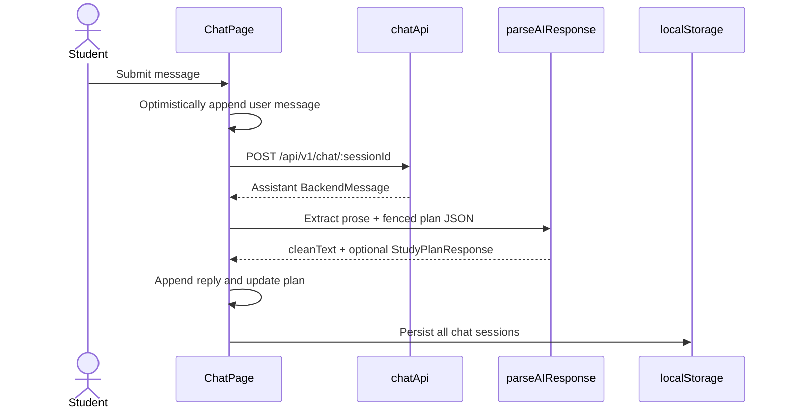
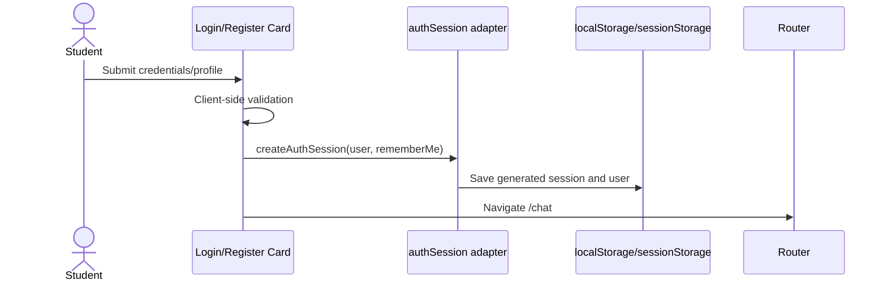

# Courseo Frontend System Architecture

## 1. Scope and system boundary

This document describes the frontend in this repository as implemented. The backend is an external system; only the HTTP contract visible in `src/lib/chatApi.ts` is documented. Labels in the Settings UI such as “Planning Agent”, “Validation Engine”, and “Data Sanitisation Engine” are presentation-only status rows and are not frontend integrations.

Courseo is a browser-based React single-page application (SPA). It collects an enrolment record, creates or resumes backend chat sessions, renders conversational guidance, extracts structured study-plan JSON embedded in assistant responses, and stores a local browser-side working history.

## 2. Context diagram



## 3. Runtime container view



There is one deployable frontend container: static HTML, JavaScript, CSS, and image assets produced by Vite. Development requests under `/api` are proxied to `http://127.0.0.1:7777`. Production uses same-origin API paths by default or `VITE_API_BASE_URL` when the backend is deployed on another origin.

## 4. Layers

### 4.1 Bootstrap and build layer

| Element | Responsibility | Dependencies |
|---|---|---|
| `index.html` | Browser HTML entry and React mount point | Built assets |
| `src/main.tsx` | Creates the React root, enables Strict Mode, loads global CSS | `App`, React DOM |
| `src/App.tsx` | Installs the router provider | `src/routes.tsx` |
| `vite.config.ts` | React/Tailwind compilation, `/api` development proxy, `@` alias | Vite plugins |
| `src/styles/*` | Tailwind import, theme variables, fonts | Browser CSS |

Build pipeline: TypeScript type-check (`tsc`) → Vite dependency graph and route chunks → static assets in `dist/`.

### 4.2 Routing and composition layer

`src/routes.tsx` owns the route table and lazy-loads each route module.

| URL | Page component | Purpose |
|---|---|---|
| `/` | `StartPage` | Enrolment entry plus login/register/tutorial modal modes |
| `/login` | `LoginPage` | Standalone login shell |
| `/register` | `RegisterPage` | Standalone registration shell |
| `/chat` | `ChatPage` | Main conversation and study-plan workspace |
| `/settings` | `SettingsPage` | Profile, planning, notification, and system presentation |

There is currently no route guard, nested layout route, 404 route, or error boundary. Authentication is local UI session state and does not restrict route access.

### 4.3 Page/controller layer

#### StartPage

- Owns modal mode: `start | login | register | tutorial`.
- Validates that enrolment text is non-empty.
- Calls `startChat(enrolment)`.
- Persists the enrolment and one-time bootstrap API response.
- Navigates to `/chat` after successful creation.
- Embeds `LoginCard`, `RegisterCard`, or `HelpSlider` without initializing the chat workspace beneath the modal.

#### LoginPage and RegisterPage

- Export reusable card components and standalone routed page shells.
- Perform client-side field validation.
- Create a local auth session through `authSession.ts`.
- Navigate to `/chat` after local success.
- They do not currently call a backend identity service; passwords are validated in the browser but are not transmitted or persisted.

#### ChatPage

- Acts as the primary application controller and currently owns most chat domain behavior.
- Hydrates chats and one-time bootstrap data from browser storage.
- Holds active chat, messages, study plan, request state, errors, responsive panels, and modal state.
- Creates new backend sessions with the stored enrolment record.
- Sends messages to an existing backend session.
- Parses fenced JSON from assistant content into `StudyPlanResponse` and removes it from displayed prose.
- Synchronizes chat state back to local storage.
- Composes sidebar, message renderer, composer, study plan, mobile panels, and modals.

#### SettingsPage

- Holds profile and settings controls in local React state.
- Synchronizes username/email to the local auth session.
- Most degree, AI, notification, service-status, and danger-zone controls are currently UI-only and are not persisted or connected to APIs.

### 4.4 Presentation/component layer

| Component | Responsibility |
|---|---|
| `CourseoSidebar` | Searchable chat navigation and utility actions; owns only its search query |
| `StudyPlan` | Renders year/session/subject hierarchy from structured plan data |
| `SubjectCard` | Renders one subject summary |
| `MessageRenderer` | Renders a limited markdown-like subset: bold, bullets, numbering, quotes |
| `HelpSlider` | Swiper-driven tutorial modal |
| `AccountManagement` | Local auth-profile editing modal |
| `HandbookModal` | Static handbook/policy presentation |
| `CourseoBackground` | Reusable background wrapper; currently not consumed by pages |

UI libraries are Tailwind CSS for styling, Framer Motion for transitions, Lucide for icons, and Swiper for the tutorial.

### 4.5 Client domain and transformation layer

Chat-specific domain types and transformations currently live inside `ChatPage.tsx`:

- `Message`: frontend message with a `Date` timestamp.
- `ChatSession`: local/backend IDs, title, messages, and optional study plan.
- `toFrontendMessage`: converts the backend message shape.
- `parseAIResponse`: extracts the first fenced `json` block and parses it as a study plan.
- `buildChatTitle`: derives a title from the latest user message.
- `loadInitialChats`: hydrates serialized timestamps and merges bootstrap data.

Study plan types live in `src/types/studyPlanType.tsx`: `StudyPlanResponse → YearPlan[] → SessionPlan[] → Subject[]`.

Important boundary: the parsed JSON is cast to `StudyPlanResponse` but not runtime-schema validated. Invalid-but-parseable structures can therefore fail later during rendering.

### 4.6 Integration/service layer

`src/lib/chatApi.ts` is the sole active remote integration.

| Function | Method and path | Input | Output |
|---|---|---|---|
| `startChat` | `POST /api/v1/chat` | `{ message: enrolment }` | `ChatResponse` |
| `continueChat` | `POST /api/v1/chat/:sessionId` | `{ message }` | `ChatResponse` |
| `getChatHistory` | `GET /api/v1/chat/:sessionId` | Path session ID | Session metadata and messages |

`ChatResponse` contains `session_id` and a `reply`. A backend message contains `id`, `role`, `content`, `created_at`, and optional provider/model metadata.

The shared request helper applies JSON headers, parses successful JSON, and converts non-2xx responses to `Error`, preferring the backend `detail` property. It currently has no timeout, cancellation, retry, authentication header, or response schema validation.

`src/lib/mockAI.tsx` contains an unused deterministic mock response generator. It is not part of the active runtime path.

### 4.7 Persistence and session layer

`src/lib/storageKeys.ts` is the ownership registry for browser storage. `src/lib/authSession.ts` manages local session serialization.

| Key | Storage | Producer | Consumer | Lifecycle |
|---|---|---|---|---|
| `courseoAuthSession` | session or local | Login/register | Settings/account UI | 12 hours or 30 days |
| `courseoUser` | session or local | Auth adapter | Compatibility copy | Same as auth session |
| `courseoEnrollment` | local | StartPage | ChatPage | Until Courseo data is cleared |
| `courseoBootstrapChat` | local | StartPage | ChatPage | Removed after chat hydration/persistence |
| `courseoChats` | local | ChatPage | ChatPage | Working history across reloads |
| `courseoPendingPrompt` | local | No active producer in repository | ChatPage | Removed after attempted dispatch |

“Remember me” selects `localStorage`; otherwise auth uses `sessionStorage`. The adapter removes an older session from the other storage location. Logout clears only Courseo-owned keys rather than all data for the web origin.

This is not secure server authentication: session IDs and users are client-generated, route access is unrestricted, and the API client does not attach the local auth session.

### 4.8 Asset layer

- `courseo-bg.png`: shared full-screen background; approximately 2.6 MB in the current production output.
- `courseo-logo.png`: shared brand mark; approximately 95 KB.
- `slider1.png`, `slider2.png`, `slider3.png`: tutorial images; loaded with the lazy help feature chunk but emitted as independent assets.

## 5. Primary data flows

### 5.1 Enrolment-to-chat sequence



### 5.2 Continue-chat sequence



### 5.3 Local auth sequence



## 6. Dependency rules as implemented

```text
main → App → routes
routes → pages (lazy boundaries)
pages → components + lib + types + assets
components → components + types + assets
lib → browser APIs / remote HTTP
types → no runtime dependencies
```

Desired rule: components should not import pages, and integration modules should not import UI. One current exception to clean layering is `StartPage` importing reusable auth cards from page modules. Moving cards to `components/auth/` would eliminate that page-to-page dependency.

## 7. Deployment and configuration

- Required runtime: modern browser with `fetch`, Web Storage, and Web Crypto support.
- Development frontend: Vite dev server.
- Development API: `/api` proxied to `http://127.0.0.1:7777`.
- Production API, same origin: no environment variable required.
- Production API, separate origin: set `VITE_API_BASE_URL`, for example `https://api.example.com`.
- The hosting platform must serve `index.html` as the fallback for client routes such as `/chat` and `/settings`.

## 8. Quality, security, and operational gaps

### High priority

1. Replace local-only auth with a backend identity flow, secure cookie/token handling, and route authorization.
2. Runtime-validate API responses and extracted study-plan JSON before rendering.
3. Add request cancellation/timeouts so navigation and repeated requests do not leave stale updates.
4. Avoid storing raw enrolment records and full chat content indefinitely in unencrypted local storage if they can contain personal data.

### Medium priority

1. Split `ChatPage` into a chat hook/reducer, persistence adapter, response parser, and smaller workspace components; it is currently the largest controller at about 800 lines.
2. Split `SettingsPage` into tab modules and introduce a persisted settings model or backend endpoint; many controls currently imply behavior they do not implement.
3. Move `LoginCard` and `RegisterCard` from page modules into `components/auth` to remove cross-page imports.
4. Add a route error element, not-found route, loading fallback, and authenticated-route boundary.
5. Replace the custom message parser with a safely configured Markdown renderer if richer backend output is required.
6. Add unit tests for session expiry, bootstrap merging, response parsing, and API errors; add interaction tests for chat and registration.

### Performance and maintainability

1. Convert the 2.6 MB background and large tutorial screenshots to WebP/AVIF with responsive variants.
2. Lazy-load modal implementations from Chat/Settings when opened; Swiper is already separated into its own build chunk through route/module boundaries but remains a sizable dependency.
3. Remove or formalize the unused `mockAI.tsx`, empty `context/hooks/services/utils` directories, duplicate `public/index.html`, and unused `CourseoBackground` component.
4. Rename non-JSX files `studyPlanType.tsx` and `mockAI.tsx` to `.ts`.
5. Configure linting/formatting and `noUnusedLocals` after clearing existing dead imports.

## 9. Changes applied during this architecture pass

- Added lazy route modules so navigation loads page code on demand.
- Removed the hidden live `ChatPage` instance from the start screen, preventing duplicate chat initialization and persistence side effects.
- Changed the API default to same-origin paths so it uses the configured development proxy and supports normal production hosting.
- Centralised all browser-storage keys and introduced scoped Courseo storage cleanup.
- Replaced broad `localStorage.clear()` / `sessionStorage.clear()` logout behavior.
- Fixed a machine-specific absolute asset import.
- Retained and validated the optimised auth popup changes made immediately before this pass.

## 10. Diagram-generation index

Use these node identifiers consistently in derived diagrams:

| ID | Node | Kind |
|---|---|---|
| `FE_BOOT` | main/App | Bootstrap |
| `FE_ROUTER` | routes | Router |
| `FE_START` | StartPage | Page/controller |
| `FE_LOGIN` | LoginPage/LoginCard | Page/auth UI |
| `FE_REGISTER` | RegisterPage/RegisterCard | Page/auth UI |
| `FE_CHAT` | ChatPage | Page/controller |
| `FE_SETTINGS` | SettingsPage | Page/controller |
| `FE_SIDEBAR` | CourseoSidebar | Component |
| `FE_PLAN` | StudyPlan/SubjectCard | Component |
| `FE_MESSAGE` | MessageRenderer | Component |
| `FE_MODALS` | Help/Account/Handbook | Components |
| `FE_API` | chatApi | Integration adapter |
| `FE_AUTH` | authSession | Session adapter |
| `FE_STORAGE` | storageKeys/Web Storage | Persistence adapter |
| `BE_CHAT` | Courseo Chat API | External system |

